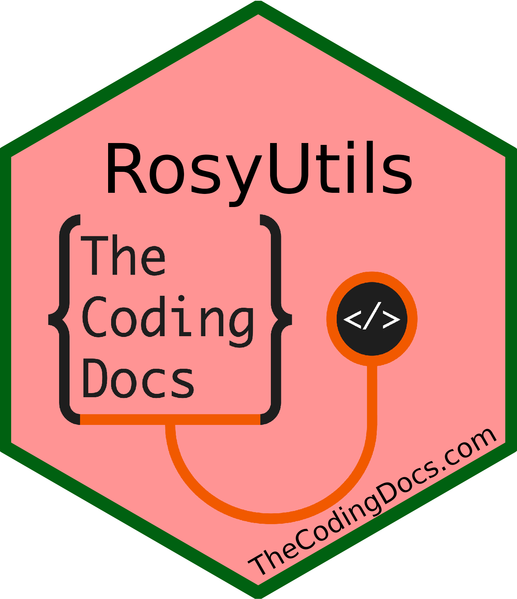

<!-- README.md is generated from README.Rmd. Please edit that file -->

# RosyUtils 

<!-- badges: start -->

[](https://lifecycle.r-lib.org/articles/stages.html#experimental)
<!-- badges: end -->

A staging package to demonstrate various custom R functions. Part R
packages maintained by Brandon Rose’s “Rosyverse” and some functions
used in other packages like RosyREDCap

## Installation

You can install the development version of RosyUtils like so:

``` r
# install remotes package if you don't have it
# install.packages("remotes") 
remotes::install_github("brandonerose/RosyUtils")
```

If you have any issues above download the most recent version of R at
RStudtio and update all packages in RStudio. See
[thecodingdocs.com/r/getting-started](https://www.thecodingdocs.com/r/getting-started "R Getting Started").

## Microsoft Outlook Clean Up Example

The following uses the
[Microsoft365R](https://github.com/Azure/Microsoft365R "Microsoft365R")
package from Microsoft Azure. RosyUtils leverages this package to
automate simple deletion of emails from certain email addresses in bulk!

``` r

library("Microsoft365R") #install.packages("Microsoft365R")
library("RosyUtils") # remotes::install_github("brandonerose/RosyUtils")

# outlook <- get_personal_outlook() 
outlook <- get_business_outlook() # this will open authenticator in Microsoft to allow Microsoft365R to use the graph API. May have to run several times at first.

inbox <- outlook$get_inbox()

# the following function will sample the first 1,000 (n) emails from your inbox
# then it will sort all the from addresses and count how many emails there are
# It will print all of the sampled subject lines from this email to aid your choice
# It will ask if you want to delete anything from this email. 1 for Yes and 2 for No
# then it will search for ALL emails in your inbox from this
# again will show subject but this time for all
# final choice for deleting
# if you choose yes it will print message as it deletes
# you can stop anytime with escape button!
# you have the option to change to full_address = F which will use the root email
# for example searching by from med.miami.edu instead email@med.miami.edu
choose_emails_to_delete_in_bulk(inbox, full_address = T, n = 1000)

# BELOW IS A DEMO OF THE GENERAL STEPS USED BY THE FUNCTION ABOVE -------

#you can list your emails like this!
emails <- inbox$list_emails(n=500) # may take ~10-20 seconds

#RosyUtils can summarize this object for you as a data.frame!
emails_sum <- summarize_emails(emails)

#top 10 emails from your sample of 500
emails_sum$email %>% table() %>% sort(decreasing = T) %>% head(10)


#top 10 emails ROOTS from your sample of 500
emails_sum$email2 %>% table() %>% sort(decreasing = T) %>% head(10)

#top email from
top_email <- (emails_sum$email %>% table() %>% sort(decreasing = T) %>% names())[[1]]

#all the emails from the top_email (max n=1000)
emails_from <- outlook$list_emails(search = paste0("from:",top_email),n=1000)

#final summary of all emails from top_email
emails_from_sum <- summarize_emails(emails_from)

#then we can use Microsoft365R to delete! For details see full function "choose_emails_to_delete_in_bulk" 
# Not including code here so as to not provide code that will delete emails without asking user.
```

## Future plans

- Future versions will demonstrate more advanced features already
  included!
- Documentation needs to be updated
- Need to add vignettes
- Open to collaboration/feedback

## Links

The RosyUtils package is at
[github.com/brandonerose/RosyUtils](https://github.com/brandonerose/RosyUtils "RosyUtils R package")
See instructions above. Install remotes and install RosyUtils

Donate if I helped you out and want more development (anything helps)!
[account.venmo.com/u/brandonerose](https://account.venmo.com/u/brandonerose "Venmo Donation")

For more R coding visit
[thecodingdocs.com/](https://www.thecodingdocs.com/ "TheCodingDocs.com")

For correspondence/feedback/issues, please email
<TheCodingDocs@gmail.com>!

Follow us on Twitter
[twitter.com/TheCodingDocs](https://twitter.com/TheCodingDocs "TheCodingDocs Twitter")

Follow me on Twitter
[twitter.com/BRoseMDMPH](https://twitter.com/BRoseMDMPH "BRoseMDMPH Twitter")

[](http://www.thecodingdocs.com)
